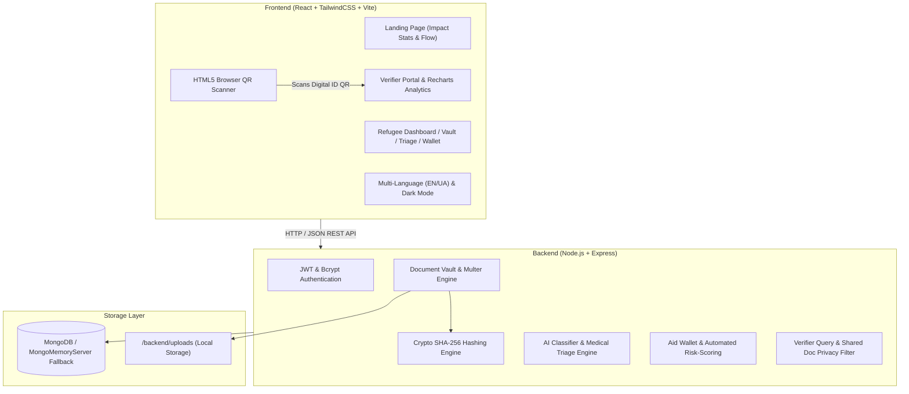

# IdentiChain 🌐🛡️
### Refugee-Owned, Cross-Border, AI-Powered Digital Identity & Document Vault

IdentiChain is a self-sovereign digital identity platform designed for people displaced by war and humanitarian crises (inspired by displacement corridors like the Ukraine/Russia conflict). When individuals flee conflict zones, physical passports, medical records, property deeds, and diplomas are often destroyed or lost. Existing systems fail because national applications (e.g. Ukraine's Diia) stop working when crossing borders, institutional databases (UNHCR biometrics) are not refugee-owned, and regional locker systems (DigiLocker, Singpass) lack cross-border interoperability.

IdentiChain solves this with an individual-owned, cryptographically verified SHA-256 document vault, AI symptom triage, emergency micro-aid wallet, and a verifier QR scanning portal that works across partner clinics, banks, and NGOs in any country.

---

## 📐 System Architecture Diagram



---

## ✨ Core Features

1. **Authentication & Digital Identity**:
   - Secure signup/login with JWT tokens and bcrypt password hashing.
   - Generates a unique Digital ID (UUID: `IDC-8F92-4A71-9B3E`).
   - Downloadable & printable QR Code identity card for offline border presentation.

2. **Multi-Category Document Vault**:
   - Stores documents in 3 categories: *Identity Documents*, *Medical Records*, *Education & Property Documents*.
   - Generates SHA-256 cryptographic hashes upon upload for tamper-proof verification ("Verified & Immutable" badge).
   - Granular Privacy Toggle: "Private" vs "Shareable with verified organizations".

3. **AI Engine**:
   - **AI Document Classifier**: Auto-categorizes and tags uploaded files based on filename heuristics and content keywords.
   - **AI Medical Triage**: Symptom checker returning `Mild`, `Moderate`, or `Urgent` urgency classification, explanation, and action steps (operates via OpenAI/Gemini or rule-based fallback).

4. **Fintech Aid Wallet**:
   - Balance ledger and transaction history.
   - "Request Emergency Micro-Aid" wizard with automated AI risk scoring (0-100 score + instant approval/rejection rationale).

5. **Verifier Portal (NGO / Clinic / Bank)**:
   - Search by Digital ID or camera QR code scanning.
   - Respects user privacy: Displays **ONLY shared documents** (private documents remain completely masked).
   - System-wide Recharts analytics dashboard (refugee count, verified docs, triage breakdown, aid disbursed).

6. **Cross-Border Partner Network Simulation**:
   - Corridor map & status grid demonstrating cross-border interoperability across Poland, Germany, Romania, Czechia, and Moldova.

---

## 🚀 Quick Start & Installation

### Prerequisites
- Node.js (v16+)
- npm

### 1. Install Dependencies
In the root directory, run:
```bash
npm install
cd backend && npm install
cd ../frontend && npm install
cd ..
```

### 2. Seed Database
Populate demo refugee accounts, verified documents with SHA-256 hashes, verifier accounts, and transaction history:
```bash
npm run seed
```

### 3. Run Application
Start backend API (port 5000) and frontend dev server (port 3000) concurrently:
```bash
npm run dev
```
Or start individually:
- Backend: `cd backend && npm start`
- Frontend: `cd frontend && npm run dev`

Open your browser to [http://localhost:3000](http://localhost:3000).

---

## 🔑 Seed Demo Credentials

For quick pitch testing, see `SEED_DEMO_CREDENTIALS.md`:
- **Refugee Account**: `oksana@identichain.org` / `refugee123`
- **Verifier Account (Clinic)**: `verifier.clinic@identichain.org` / `verifier123`
- **Verifier Account (Bank)**: `verifier.bank@identichain.org` / `verifier123`

---

## 🌐 Cloud Deployment Guide (Render / Vercel / AWS)

### Environment Variables
Configure the following in your cloud server (e.g. Render / Heroku):
```env
PORT=5000
JWT_SECRET=your_production_jwt_secret
MONGODB_URI=mongodb+srv://<user>:<password>@cluster.mongodb.net/identichain
NODE_ENV=production
OPENAI_API_KEY=optional_openai_key
GEMINI_API_KEY=optional_gemini_key
```

### Build Command
```bash
cd frontend && npm run build
```

---

## 📜 License
IdentiChain is released under the MIT License for humanitarian tech empowerment.
